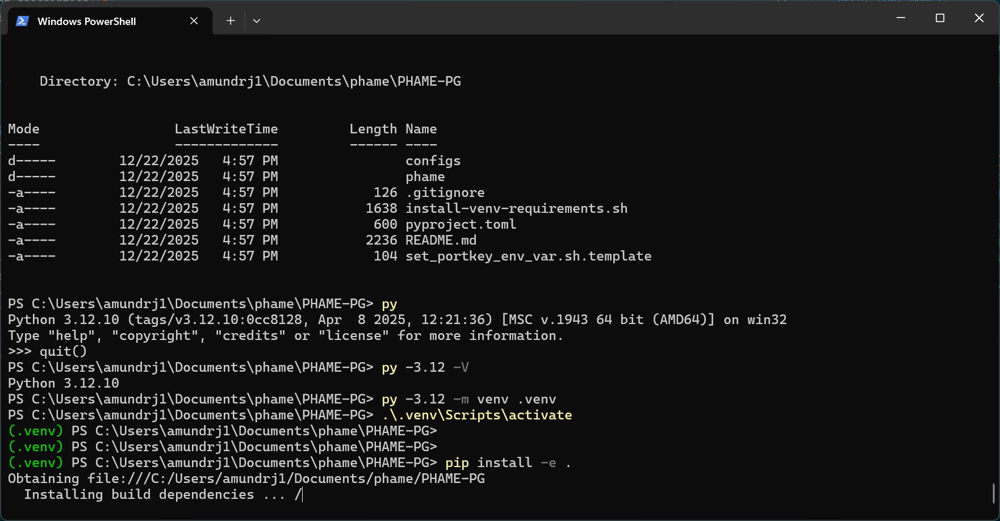

# PHAME PG


## Getting started

This repo is meant for developing the PHAME agentic model for engineering part design automation. 

### To create the approprate environment, run:

```
conda env create -f environment.yml
conda activate phame
```

OR

If you would rather work with venvs read the directions in install-venv-requirments.sh

```
sudo apt install wget build-essential libssl-dev libffi-dev tmux zlib1g-dev -y
git clone git@gitlab.jhuapl.edu:phame/PHAME-PG.git
cd PHAME-PG
sudo apt install python3.12-venv
/usr/bin/python3.12 -m venv .venv
source ./.venv/bin/activate
pip install -e .
```

If you plan on running agents that require windows tools (e.g SolidWorks or ANSYS), setup is the following
- Download python from https://www.python.org/downloads/windows/
- Following windows Proxy server Python instructions at https://aplprod.servicenowservices.com/now/nav/ui/classic/params/target/kb_view.do%3Fsysparm_article%3DKB0015043
- Open Powershell
- Run these commands
```
cd <project_dir>
git clone git@gitlab.jhuapl.edu:phame/PHAME-PG.git
cd PHAME-PG
py -3.12 -m venv .venv
.venv\Scripts\activate
python -m pip install --timeout 300 --upgrade pip setuptools wheel
pip install -e . --timeout 300
```



### Setup PORTKEY on your system to authenicate with OPAL

Follow directions to Create a Portkey API Key at: 
https://jhuapl.enterprise.slack.com/docs/T01BQG1SGSV/F098P9R3AL9

```
export PORTKEY_BASE_URL="https://aigateway.jhuapl.edu/v1"
export PORTKEY_API_KEY=[YOUR KEY]
```

If useful to the developer, there is a shell script helper template at set_portkey_env_var.sh.template

See: https://gitlab.jhuapl.edu/phame/PHAME-PG/-/blob/main/install-venv-requirements.sh?ref_type=heads

Rename to set_portkey_env_var.sh and execute like

```
source set_portkey_env_var.sh
```

For Windows Setup:
Similarly, rename to set_portkey_env_var.ps1.template to set_portkey_env_var.ps1 and execute like

```
.\set_portkey_env_var.ps1
```

An alternate approach if using virtual environments, @amundrj1 had success with modifying the .venv/Scripts/Activate.ps1 file of his python virtual environment by inserting the following

```
$Env:PORTKEY_BASE_URL = "https://aigateway.jhuapl.edu/v1"
$Env:PORTKEY_API_KEY = "[Your API Key]"
$Env:SSL_CERT_FILE = (python -c "import certifi, sys; sys.stdout.write(certifi.where())")
```

Below this

```
# Add the venv to the PATH
Copy-Item -Path Env:PATH -Destination Env:_OLD_VIRTUAL_PATH
$Env:PATH = "$VenvExecDir$([System.IO.Path]::PathSeparator)$Env:PATH"
```

but before this


```
# SIG # Begin signature block
```

### Make a configuration file the used the form of configs/test_portkey.yml


You can select any model from 
https://status.livelab.jhuapl.edu/status/opal-models


### To run the RAG embedding code, do:

```
python rag_utils/build_rag.py --pdf_dir DIR_OF_PDFS --config YOUR_CONFIG
```

For opal portkey credentials, go to [APL's Portkey URL](http://aiportal.jhuapl.edu/). Go to "Getting Started", and generate a key. Export your portkey api and base URL:

### Text2CAD

CSV input data: https://jhuapl.app.box.com/folder/351550501920

Generate RAG DB:
```
python phame/rag_utils/build_rag_text2cad.py --persist_dir part_db/
````

Running RAG Query:

```
time python phame/llm/generate_part_rag.py -d "The design is a bicycle." -o "bicycle.py" --persist_dir part_db/ --top_k 2 --model "@openai-enterprise-pilot/o3"
```

Fix Part:
```
time python phame/llm/fix_cad.py -d "The design is a bicycle." -o "bicycle_fixed.py" --model "@openai-enterprise-pilot/o3" --code bicycle.py --issues "- The wheels are perpendicular from what they should be\n- The frame is missing a down tube\n- There are no pedals. "
```

Visualize Output:
Go to: https://3dviewer.net
